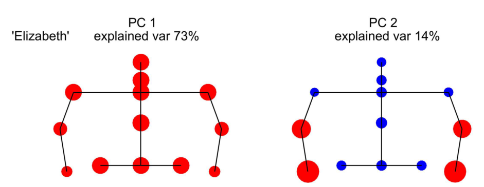

<!-- Replication reports should all use this template to standardize reporting across projects.  These reports will be public supplementary materials that accompany the summary report(s) of the aggregate results. -->

#Introduction

##Summary and Motivation

This paper studies *nonverbal synchrony*, the natural coordination of body movement between interacting individuals. Nonverbal synchrony is defined as a dynamic quality of movement, measured objectively and automatically, including both simultaneous movement and movement in a short time-lagged window [@Ramseyer2011]. To put it poetically, it is the individual words of body language. 
Early studies (1970s-1990s) were limited by quality or quantity of data. Individual body motions were collected by human coders, proving expensive in time or money. In contrast, in order to collect data on many subjects, the analysis was computational, and computers only measured motion holistically. 
Virtual reality tracking and today's devices like the Microsoft Kinect can collect nonverbal data with both quality and quantity. The challenge to current research, then, is finding, validating, and motivating methods with which to analyze the data. 
I plan to use a measure of synchrony in future studies, and so both developing the code to complete a data analysis pipeline and understanding the space and dangers in some of the analyses would be helpful to my future work.

##Procedure and Challenges

The data pipeline I will replicate mirrors the analysis given in the paper:

1. Smooth and clean the Kinect tracking data. This involves dropping frames and body parts that were not tracked in some frames, and smoothing the remaining data.
2. Convert position data to the more theoretically and perceptually salient velocity data.
3. Analyze the joint velocities using principal component analysis (PCA), and verifying their size relative to shuffled data as a control.
4. Use the PCA basis to determine whether a segment is a still, solo, or co-active motion segment.
5. Considering only the co-active motion segments, run PCA again to find the common co-active motion modes.
6. Calculate motion motifs by comparing against a time-rotated control dataset.

The results to replicate include:

1. Torso motion is the strongest component in PCA, accounting for 57%-95% of variance
2. Arm motion is the second strongest component, but it is much weaker.
3. Parallel-synchronized torso motion and mutual stillness are the two motion motifs.
4. Dyads show individuality in their mode distributions, i.e, the same dyad at different times or in different tasks show distributions more similar than different dyads in the same distribution.

The challenges will be both methodological and technical. The method as written appears to be unclear or underspecified at points. This is compounded by the complexity of the analysis. When two results do not match up, it may be an error from method, reporting, understanding, or programming - and if that data analysis had multiple steps before reaching a verifiable value, then a problem can exist in any or all of those steps.

## Links

- [Repository](https://github.com/MrMallIronmaker/gaziv2017)
- [Original Paper](https://github.com/MrMallIronmaker/gaziv2017/blob/master/original_paper/journal.pone.0170786.pdf)

# Methods

The data in question does not need to be collected, because this is a project of reproduction not replication. The data is available at the [Dryad digital repository](https://datadryad.org/resource/doi:10.5061/dryad.804j3).

Because this is a reproducability study, it is important to be precise in the formalization of the data analysis. Therefore, mathematial notation is appropriate. Through this process, areas of the paper that are underspecified are discovered. Within these areas, assumptions are made explicit rather than left to interpretation. Though mathematical notation can be very _precise_, it can often be _unclear_. Care will be taken to ensure the mathematics given is both precise and clear.

### Defining the Raw Data
Define $J$ as the set of joints tracked by the Kinect - e.g, head, torso, shoulders, arms, hands, hips, and feet, and define $J_{U}$ as the joints in the upper body. Furthermore, define $P$ as the set of participants in the experiment.

Let the raw Kinect data (step 0) be a function $X_{0}:P\times J\times\mathbb{W}\rightarrow\mathbb{R}^{3}$ that maps a participant's joint at a particular frame to its position in 3D space. Intuitively, this means each joint and frame in the recording has a 3D point associated with it.

### Smoothing
The first filter applied is based upon the paper text:

> To smooth the data we removed position points which deviate discontinuously from their neighbors using a filter that removes the extreme points in a 5-timepoint window before averaging the remaining points.

This is formalized with the function

$$X_{1}(p,j,f)=\frac{\mbox{sum } nearby(X_{0},p,j,f)-\min nearby(X_{0},p,j,f)-\max nearby(X_{0},p,j,f)}{3}$$
 

where $nearby(X,p,j,f)=\{X(p,j,f)|i\in\mathbb{Z},f-2\leq i\leq f+2\}$
 
Note that it is ambiguous whether both the maximum and minimum points are taken out, or only one. The paper does not specify the method for choosing which point (min or max) to take out, so I presume both the maximum and minimum are removed. It is also ambiguous what happens if two entries have the same maximum or minimum value. I have made the decision that exactly one is removed, not both. In addition, it is unclear what happens to points that do not have two neighbors in both directions, i.e, the beginning and end. One could ignore the beginning and end timesteps, or shorten the window. I presume the data is thrown out.

The second filtering step is choosing the median in a five-step window three times. The paper text says:

> We then used three consecutive rounds of a 5-window median filter.

In pseudocode, this is written as:
```
define median_filter(X, p, j, f)
  return median(nearby(X, p, j, f))

old_data <- X_1
for i=1 up to 3:
  new_data(p, j, f) <- median_filter(old_data, p,  j, f)
  old_data <- new_data
  
X_2 <- new_data
```

Again, it is unclear what happens to points that do not have its nearby neighbors, and so I presume the data is thrown out.

The paper goes on to describe that:

> After this smoothing, the data is suitable for differentiation to obtain velocities.

Once the data was smoothed, discrete differentiation was performed between steps
$$V(p, j,f)=FPS\cdot(X_{2}(p, j,f+1)-X_{2}(p, j,f))$$
where FPS is the number of frames per second, i.e, 30. This factor is included because the discrete difference between the frames is only $1/FPS$ seconds. Note that the values of $V(j,f)$ are 3D vectors. 

There are other ways of performing differentiation, including different choices of convolution kernels. The one I have chosen is $[1, -1]$, which is simply the change in value between frames. There are other options, e.g, the symmetric difference quotient, where the filter is $[1, 0, -1]$ and the multiplicative factor is $FPS/2$.

### PCA Analysis
To perform PCA among the joints, rather than among the three dimensions for each joint, we collapse the velocity vector to a speed value.
This is done with a traditional Euclidean norm $S_0(p, j,f)=\|V(p, j,f)\|$, according to the text:

> We considered the speed (root of the sum of the squared x, y and z velocities) of each of 13
upper body joints per participant for time samples acquired throughout the three-round data-
set. 

The text continues to say

> We normalized the speed of each joint to mean zero and standard deviation of one...

This normalization is done per joint per participant, i.e,
$$S_{1}(p, j,f)=\frac{S_0(p, j,f)-\mu(S_{all}(p, j))}{\sigma(S_{all}(p, j))}$$
where $S_{all}(p, j)=\{S_0(p, j,i)|0\leq i<f_{max}\}$. Note that in order to do this, some value for $f_{max}$ should be specified. No particular cutoff time is given, so I assume it will be for all available frames of data.

In performing PCA, we specify the vector to be the list of speeds of each upper-body joint at a given frame, i.e:

$$
\vec{S}_2(p, f)=\begin{bmatrix}S_{1}(p, \mbox{head},f)\\
S_{1}(p, \mbox{neck},f)\\
S_{1}(p, \mbox{left shoulder},f)\\
\vdots\\
S_{1}(p, \mbox{right hip},f)
\end{bmatrix}
$$

The resulting set of vectors for each participant, $\{\vec{S}_{2}(p, f),0\leq f<f_{max}\}$, is the subject of PCA analysis. The PCA analysis provides evidence for or against Hypothesis 1 and 2, detailed below.

### Determining still, solo, or co-active motion segments

In order to determine still or motion segments, a single value must be compared with a threshold for each participant. The text for determining this threshold says:

> The threshold used for each participant, and each
round was the maximum of: (1) 15% max speed of the participant in the round and (2) 15%
max speed of all participants in the entire dataset.

First, it is unclear what the "speed of the participant" is. The speed of each joint of our participant is well-defined, it is $S_1(p,j,f)$. However, our representation of the speed for each participant at each frame, $\vec{S}_{2}(p, f)$, is a vector rather than a scalar, therefore its comparison is not well-defined. 

In the Results section, rather than the Data Analysis section, there is a clue towards this problem. They reduce the complexity of the dataset by focusing upon the torso motion:

> Due to the predominance of PC1, which describes rigid torso motion, and its similarity
between participants, for the remaining analysis we focused on the motion of the torso of conversants. As a proxy for rigid torso motion, we use the most robustly resolved body coordinates, the two skeletal coordinates at the sides of the pelvis.

Because of this section, I assume the speed for a participant is the speed of the pelvis, $S_{1}(p,\mbox{pelvis},f)$ .

The thresholding is now syntactically correct, and can be expressed in its two parts as such:

$$t_{1}(p)=\max_{0\leq f<f_{max}}\frac{15}{100}S_{1}(p,\mbox{pelvis},f)$$

$$t_{2}(p)=\max_{p'\in P}\max_{0\leq f<f_{max}}\frac{15}{100}S_{1}(p',\mbox{pelvis},f)$$

However, it becomes clear upon inspection that $t_1(p) \leq t_2(p)$ among any participant because the maximum across all participants includes the participant in question. The instruction clarifying that the maximum should be used between the two implies that $t_1(p)$ is entirely useless. 
It is unlikely that an uncessary step would be expressed in the writeup, therefore either the authors did not forsee this consequence, did not communicate their process clearly, or I am having trouble interpreting it. 
While I did contact the original authors, it has only been three days since I've sent an email at the final project due date, so it is not enough time for the authors to respond.

Regardless of these difficulties, let us assume a threshold value is chosen represented by $t(p)$. For my analysis, I chose $t_1(p)$. The classification between a still and a moving segment for a particular participant is indicated in the text:

> Using a sliding window of 2-sec, we calculated the RMS of this speed in each window for each
participant. We then compared it with two corresponding thresholds to mark the segment as
‘still’, ‘solo’ of either party, or ‘co-active’.

The speed within a particular windows is the RMS of all the participant speeds within that window. Note that the second argument $i$ to $S_{1}(p,\mbox{pelvis},i)$ is a frame number and so the 1-second durations on each side of it are measured in frames per second.

$$S_3(p,f)=RMS( \{ S_{1}(p,\mbox{pelvis},i) , f-FPS<i\leq f+FPS\})$$

The evidence that RMS is the correct method to combine the "participant speed" measures is the text saying:

> Using a sliding window of 2-sec, we calculated the RMS of this speed in each window for each
participant.

The value $S_3(p, f)$ is then compared to $t(p)$ in order to determine whether a participant is "moving" or "still". If both participants are still, the dyad is "still". If only one is moving, then it is "solo motion". If both are moving, then the dyad is "co-active."

### Classification of Torso Motion to Dyad Modes
When the dyad is co-active, a further classification is performed. Continuing to focus on the pelvis as an approximation for the torso, as an approximation for the broadest kind of body motion, the text says:

> We therefore define a dyadic coordinate system based on the two torsos in the plane. This system has 6 coordinates, with three coordinates per person: $v_\parallel$ is velocity parallel to the person’s pelvis, $v_+$ is velocity
perpendicular to the pelvis, and $v_{tang}$ is twist around the center of mass of the pelvis.

Figure 6 of the paper is sufficiently clear as how these values are represented.

Let the torso velocity data be a function $T_{0}:D\times\mathbb{W}\rightarrow\mathbb{R}^{6}$ where $D$ is the set of *dyads*, rather than participants.

In each 2-second window, the PCA is computed on the set of all dyad torso velocities, 
$$T_1(d, f) = PCA_1(\{T_0(d, i),f-FPS\leq i<f+FPS\})$$
where $PCA_1$ takes a set of vectors and returns the first principal component. This vector is the dyadic 'motion mode' of that time segment.

In order to transform this continous variable from PCA into a discrete variable, the motion mode is classified with a linear classifier. The discrete mode has a basis of vectors $\bar{p_m}, p_{m,i}\in \{\pm1/\sqrt{2}, 0\}$ denoting the pure mode $m$ characterized by four loadings, parallel and perpendicular for each particiant. The mode $M_0(d,f)$ given to a dyad $d$ at a time frame $f$ is 

$$M_0(d,f) = \max_{m} \|\bar{p_m}\cdot T_1(d,f)\|$$

If one is to take the mathematical definition of $p_{m,i}\in \{\pm1/\sqrt{2}, 0\}$ literally, it appears that no pure-modes loading will ever have a value of zero - if the corresponding velocity value is positive, then having a positive loading will lead to a higher score, and vice versa.
However, one may notice that parallel and perpendicular modes are never active together in the same participant, and I propose that is the implicit constraint.

### Calculate motion motifs by comparing against a time-rotated control dataset.

In order to test the hypothesis of synchrony, i.e, time-dependent interaction between two people, one must compare against another hypothesis, i.e, people have some motion distribution and any similarities between the two motions is the accidental effect of having similar distributions.
To test this, the motion modes are calculated upon rotated time segments.

Let $\Delta_f$ be a randomly selected offset greater than one minute. The comparable dataset is:
$$T_2(d, f, \Delta_f) = PCA_1(\{join(T_0(p_1, i), T_0(p_2,i+\Delta_f)),f-FPS\leq i<f+FPS\})$$
Thirty values for $\Delta_f$ were chosen, creating thirty datasets. From these datasets, mean and standard deviation of how long each mode is active was calculated. Occurences of modes that are more than 3 standard deviations away from the mean of this generated dataset are determined to be significant.

### Measure dyad individuality

One can operationalize 'dyad individuality' as the distribution of motion modes leading to the results, such that each torso description $T_1(d,f)$ is drawn from a distribution unique to the dyad, i.e:

$$T_1(d, f) \sim M(d), 0\leq f < f_{max}$$
where $M(d)$ is a function mapping dyads to their distributions.

The test used is the Kolmogorov-Smirnov test, which compares two one-dimensional distributions. The values $T_1(d,f)$ are four-dimensional, however. The process for reduction of dimensionality is not clear, but as it is called "motion mode distribution", I have interpreted it to mean the Euclidean distance between mode distributions, where each mode distribution is an 8-entry vectors with each entry corresponding to the proportion of time in that motion mode.]

# Results

## Data Preparation

```{r libraries_and_settings, message=FALSE}
# Begin by loading libraries.
library(knitr)      # useful for table formatting
library(tibbletime) # useful for time series data
library(tidyverse)  # useful.

# by default, use the precomputed loadings table.
loadings_tbl_filename <- 'loadings_tbl_full.csv'

# turn off the messages, because they clutter the document.
opts_chunk$set(message=FALSE)

```

```{r smoothing_filter}
# The first set of functions convert the data into long format,
# and define the smoothing process.

longify <- function (df) {
  return(
    df %>%
      # drop lower-body columns
      select(
        -starts_with("Knee"),
        -starts_with("Ankle"),
        -starts_with("Foot"),
        -starts_with("Hand"),
        -starts_with("Thumb")
        ) %>%
      gather(BodyPartAndDimension, Raw, -c("Synced TS")) %>%
      extract(BodyPartAndDimension, c("BodyPart", "Dimension"), regex="(.*)_(X|Y|Z)")
  )
}

mean_without_extremes <- function(vec) {
  return((sum(vec) - min(vec) - max(vec)) / 3.)
}

# `rollify` applies a function at each row over the previous N entries. The `lead`
# function shifts the result back enough so that in effect the rollified function was
# over a range centered around the given row.
rolling_mean_without_extremes <- function(timeseries) {
  return(lead(rollify(mean_without_extremes, window=5)(timeseries), 2))
}

rolling_median <- function(timeseries) {
  return(lead(rollify(median, window=5)(timeseries), 2))
}

# concatenate the different defined functions to produce the whole smoothing process
gaziv_smoothing_filter <- function(vec) {
  return (
    vec %>%
      rolling_mean_without_extremes() %>%
      rolling_median() %>%
      rolling_median() %>%
      rolling_median()
  )
}

```

```{r speed_score}
# Once the position data is smoothed, it can be differentiated to get velocity and then
# converted to speed and speed z-score.

FPS <- 30

calculate_speed <- function(df) {
  return(
    df %>%
      # Smooth the data and calculate velocities
      group_by(BodyPart, Dimension) %>%
      mutate(
        SmoothedPosition=gaziv_smoothing_filter(Raw),
        Velocity=(SmoothedPosition - lag(SmoothedPosition)) * FPS
      ) %>%
      ungroup() %>%
      select(-c(Raw, SmoothedPosition)) %>%
      
      # now calculate speeds
      na.omit() %>%
      spread("Dimension", "Velocity") %>%
      mutate(
        Speed=sqrt(X^2+Y^2+Z^2)
      ) %>%
      select(-c("X", "Y", "Z"))
  )
}

# Transform the speed into a z-score of speed, such that each body part's speed over time
# has mean of 0 and variance 1. This is the data with which we'll perform PCA.
speed_score <- function (df) {
  return(
    df %>%
      group_by(BodyPart) %>%
      mutate(SpeedScore=scale(Speed)) %>%
      ungroup() %>%
      select(-c("Speed"))
  )
}

```


```{r}
# Now that we've gotten functions to load and process the data, let's calculate our PCA
# loadings from those speed scores in three different files.

filename_regex <- "dyad([0-9]+)_round([0-9]+)_participant([0-9]+).csv"
files_tbl <- tibble(filename=list.files("../data/")) %>% 
  extract(filename, c("Dyad", "Round", "Participant"), filename_regex, remove=FALSE) %>%
  mutate(
    Dyad = as.integer(Dyad),
    Round = as.integer(Round),
    Participant = as.integer(Participant)
  )

loadings_from_filenames <- function(filenames) {
  
  # Load and process the speeds of the participant across all rounds
  read_to_speed <- function(filename) {
    return(
      read_csv(paste("../data", filename, sep="/")) %>%
        # Uncomment this line if you want to run on a manageable subset of the data
        #head(200) %>% 
        longify() %>%
        calculate_speed()
    )
  }
  speeds <- lapply(filenames, read_to_speed)
  
  # join the tables together, then take the speed score of the joined table.
  speed_scores <- Reduce(full_join, speeds) %>% 
    speed_score()
  
  # perform PCA
  pca <- prcomp(
    speed_scores %>%
      spread(BodyPart, SpeedScore) %>%
      select(-c("Synced TS"))
  )
  
  # Return the tibble of PCs and variance entries.
  explained_variance <- (pca$sdev^2) / sum(pca$sdev^2)
  loadings <- as_tibble(pca$rotation, rownames="BodyPart") %>%
    gather(PC, Loading, -c("BodyPart")) %>%
    add_row(
      BodyPart="ExplainedVariance",       # Where is the best place to put the
      PC=paste("PC", seq(1:13), sep=""),  # ExplainedVariance values? It's hacky, but I
      Loading=explained_variance          # have put them in a separate BodyPart row.
    ) %>%
    spread(PC, Loading)
  
  return(loadings)
}

```


```{r, eval=FALSE}
# In this cell, all the work is done. By default it does not run (eval=FALSE) because it 
# took about two hours on my laptop to process.

loadings_tbl <- files_tbl %>%
  filter(Round != 4) %>%
  group_by(Dyad, Participant) %>%
  summarize(filenames = list(filename)) %>%
  mutate(
    loadings = lapply(filenames, loadings_from_filenames)
  ) %>%
  select(-c("filenames")) %>%
  unnest() %>%
  ungroup()

# save the loadings to a file (as it is costly to compute)
loadings_tbl %>% write_csv('loadings_tbl.csv')
loadings_tbl_filename <- 'loadings_tbl.csv'
```


## Confirmatory analysis

### Hypothesis 1: PC1 shows rigid motion of the body
The first principal component will explain between 57% and 95% of variance of the data, and there will be strong loadings on all joints.

The first item of interest is the explained variance of the first two principal components. 

```{r}
loadings_tbl <- read_csv(loadings_tbl_filename)

explained_variances <- loadings_tbl %>%
  filter(BodyPart == "ExplainedVariance") %>%
  select(Dyad, Participant, PC1, PC2) %>%
  gather(PC, ExplainedVariance, PC1, PC2)

kable(
  explained_variances %>% 
    group_by(PC) %>%
    summarize(
      Minimum = min(ExplainedVariance),
      Maximum = max(ExplainedVariance),
      Mean = mean(ExplainedVariance)
    ) %>% 
    mutate_at(vars(-c("PC")), scales::percent)
)
```

The values for the maximum and minimum variance are slightly off. There are many reasons for this, with the primary reason being an underspecified process. However, the values are off by a small amount, so these findings can be reproduced with minor error. To visualize the distribution of PC weights, a histogram is given below.

```{r}
ggplot(explained_variances, aes(x=ExplainedVariance)) +
  geom_histogram(aes(fill=PC), color="black", breaks = seq(0, 1, .05)) +
  ggthemes::theme_few() +
  labs(
    title="Variance explained by first two principal components",
    x="Explained Variance",
    y="Number of Participants"
  ) + 
  ylim(0, 15) +
  scale_x_continuous(labels = scales::percent)
```

The second item of interest is the breakdown of loadings on joints across participants. This is best plotted.

```{r bodyplot}
# This section provides some handy functions for plotting those body part loadings
# in a pretty, human-like figure. 

# bodyplot_points.csv specifies each body part's location in the space [-1,1]x[-1,1]
# bodyplot_lines.csv specifies which of those link with each other.
bodyplot_points <- read_csv('bodyplot_points.csv')
bodyplot_lines <- read_csv('bodyplot_lines.csv') %>%
  mutate(id=1:n()) %>%
  gather(Point, BodyPart, c("PointA", "PointB")) %>%
  left_join(bodyplot_points, by="BodyPart") %>%
  gather(Dimension, Entry, c("X", "Y")) %>%
  unite(LinePointType, Point, Dimension) %>%
  select(-c("BodyPart")) %>%
  spread(LinePointType, Entry)

bodyspacify <- function(x) {
  return(
    x %>%
      gather(PC, Loading, starts_with("PC")) %>%
      group_by(Dyad, Participant, PC) %>%
      mutate(Loading = Loading * sign(sum(Loading))) %>%
      full_join(bodyplot_points, by="BodyPart")
  )
}
```

```{r plot_loadings}

# Take the loadings, and add columns to get the points to display in their proper
# locations on the body, e.g, head at top, arm on right side, etc.
bodyspace_loadings <- loadings_tbl %>%
  filter(BodyPart != "ExplainedVariance") %>%
  bodyspacify() %>%
  mutate(                            # a hacky way to have titles display as e.g, 10.1
    pid = Dyad + Participant * 0.1   # for dyad 10 participant 1, without letting numbers
  )                                  # get ordered lexographically (1 < 10 < 11 < 2)
  
plot_graphic_loadings <- function (bodyspace_loadings, displayPC) {
  return(
    ggplot(data=bodyspace_loadings %>% filter(PC==displayPC)) + 
      facet_wrap(vars(pid), nrow=4) +
      geom_segment(
        aes(x=PointA_X, y=PointA_Y,
            xend=PointB_X, yend=PointB_Y),
        data=bodyplot_lines
      ) +
      geom_point(size=3, aes(x=X,y=Y,color=Loading)) + 
      xlim(-1.2, 1.2) +
      ylim(-1.2, 1.2) +
      scale_color_gradient2("Factor Loading", low = scales::muted("blue"), mid = "white",
  high = scales::muted("red")) +
      coord_fixed() +
      theme_void() +
      labs(title = paste("Loadings of", displayPC, "on 24 conversation participants")) +
      theme(legend.position = "bottom")
  )
}

```

For a side-by-side comparison of the joint loadings, I follow the sample plot mechanics as Gaziv et al. The two plots are below.

```{r}
bodyspace_loadings %>%
  filter(pid==8.2 & PC %in% c("PC1", "PC2")) %>%
  mutate(
    magnitude = abs(Loading),
    ptcolor = ifelse(Loading > 0, "#ff0000", "#0000ff")
  ) %>%
  ggplot() + 
  facet_wrap(vars(PC)) +
  geom_point(aes(x=X,y=Y,color=ptcolor,size=magnitude), shape="circle") + 
  geom_segment(
    aes(x=PointA_X, y=PointA_Y,
        xend=PointB_X, yend=PointB_Y),
    data=bodyplot_lines
  ) +
  
  xlim(-1.2, 1.2) +
  ylim(-1.2, 1.2) +
  scale_size_area(max_size=15) +
  scale_color_identity() +
  coord_fixed() +
  theme_void() +
  theme(legend.position = "none") +
  labs(title="    Joint Loadings (reproduced analysis)")


```

The maginute of the joint loading is represented by size, the color is sign. The results are similar between the original report and the reproduced data.

Now, are there subjects that show individual differences?

```{r pc1-plot}
plot_graphic_loadings(bodyspace_loadings, displayPC="PC1")
```

Note that all loadings are positive (red) and similarly weighted across body parts. This means that the speeds of these joints tend to all correlate positively with each other. This makes sense. For the most part, if my left hip is moving, it's likely that the rest of my body is moving with it. It is also worth noting that this first component is *very* similar across participants. These obserations align with the observations made in the paper.

### Hypothesis 2: PC2 is mostly arm motion.
The second principal component will have strong loadings on the arms for most participants.

```{r pc2-plot}
plot_graphic_loadings(bodyspace_loadings, displayPC = "PC2")
```

Note that the loadings on the arms are strong and positive (red), while the loadings on the torso and head are small and negative (light blue). This means that the most signficant source of variance, after rigid motion of the whole body, is the arms moving separately while the torso is not moving. Again, this PC is similar across all participants. This aligns with the comment by Gaziv et al. that the second PC loaded mainly on participant arms.

### Hypothesis 3: Two motion motifs will be significant
The significant motion motifs will be parallel-synchronized torso motion in 6 of 12 pairs, and mutual stillness in 4 of 12 pairs.

```{r}
# Smooth and differentiate the position data
torso_kinematics <- function(df) {
  return(
    df %>%
      longify() %>%
      filter(BodyPart %in% c("HipLeft", "HipRight")) %>%
      # smooth and calculate velocities
      group_by(BodyPart, Dimension) %>%
      mutate(
        FilteredPosition=gaziv_smoothing_filter(Raw),
        Velocity=(FilteredPosition - lag(FilteredPosition)) * FPS
      ) %>%
      ungroup() %>%
      na.omit()
  )
}

# Compute the torso velocity based upon the formulae in the paper.
torso_velocities <- function(kinematics) {
  return(
    kinematics %>%
      select(-c("Raw")) %>%
      gather(Measure, Value, FilteredPosition, Velocity) %>%
      unite(BodyPartDimensionMeasure, BodyPart, Dimension, Measure) %>%
      spread(BodyPartDimensionMeasure, Value) %>%
      mutate(
        
        # First, calculate the pelvis direction (v-hat parallel)
        PelvisDirection_X = HipLeft_X_FilteredPosition - HipRight_X_FilteredPosition,
        PelvisDirection_Z = HipLeft_Z_FilteredPosition - HipRight_Z_FilteredPosition,
        PelvisDirection_Magnitude = sqrt(PelvisDirection_X^2 + PelvisDirection_Z^2),
        NormalPelvisDirection_X = PelvisDirection_X / PelvisDirection_Magnitude,
        NormalPelvisDirection_Z = PelvisDirection_Z / PelvisDirection_Magnitude,
        
        # now calculate the center velocity
        Torso_X_Velocity = (HipLeft_X_Velocity + HipRight_X_Velocity) / 2,
        Torso_Z_Velocity = (HipLeft_Z_Velocity + HipRight_Z_Velocity) / 2,
        
        # dot-product in order to get the speed along each of those directions.
        # Note that the perpendicular vector does not need to be recomputed because
        # the 2D unit vector perpendicular to (x, y) is (y, -x).
        Parallel = NormalPelvisDirection_X * Torso_X_Velocity +
          NormalPelvisDirection_Z * Torso_Z_Velocity,
        Perpendicular = NormalPelvisDirection_Z * Torso_X_Velocity - 
          NormalPelvisDirection_X * Torso_Z_Velocity,
        
        # for the tangential velocity, project each hip separately.
        # then take the difference.
        HipLeft_Perp_Velocity = NormalPelvisDirection_Z * HipLeft_X_Velocity -
          NormalPelvisDirection_X * HipLeft_Z_Velocity,
        HipRight_Perp_Velocity = NormalPelvisDirection_Z * HipRight_X_Velocity -
          NormalPelvisDirection_X * HipRight_Z_Velocity,
        Tangential = (HipRight_Perp_Velocity - HipLeft_Perp_Velocity) / 2,
        
        # and also calculate total velocity (squared)
        TotalSquared = Perpendicular^2 + Parallel^2 + Tangential^2
      )  %>%
      select(c("Synced TS", "Perpendicular", "Parallel", "Tangential", "TotalSquared"))
  )
}

```

```{r}
# Compute the torso data from a filename.
read_and_get_torso_velocities <- function(original_filename) {
  # This process takes a long time (~60s per round per dyad per simulated dataset)
  # so it is wise to do it once, and then save the data.
  torso_velocities_filename <- paste("torso_velocities", original_filename, sep="/")
  if (file.exists(torso_velocities_filename)) {
    torso_data <- read_csv(torso_velocities_filename)
  } else {
    torso_data <- read_csv(paste("../data", original_filename, sep="/")) %>% 
      #head(4500) %>% tail(1000) %>% # uncomment this to work with smaller data.
      torso_kinematics() %>%
      torso_velocities()
    write_csv(torso_data, torso_velocities_filename)
  }
  return (torso_data)
}

# Get the dataframe and motion threshold velocities
join_torso_data <- function(filenames, offset=0) {
  
  # get each torso dataset.
  torsos <- lapply(filenames, read_and_get_torso_velocities)
  
  # rename the columns so they align nicely when joining.
  torso_a <- torsos[[1]] %>% 
    rename_at(vars(-c("Synced TS")), (function (x) paste(x, "A", sep="_") ) )
  torso_b <- torsos[[2]] %>% 
    rename_at(vars(-c("Synced TS")), (function (x) paste(x, "B", sep="_") ) )
  
  # trim both to only include the time both Kinects are running
  begin_ts <- max(min(torso_a$`Synced TS`), min(torso_b$`Synced TS`))
  end_ts <- min(max(torso_a$`Synced TS`), max(torso_b$`Synced TS`))
  torso_a <- torso_a %>% filter((`Synced TS` >= begin_ts) & (`Synced TS` <= end_ts))
  torso_b <- torso_b %>% filter((`Synced TS` >= begin_ts) & (`Synced TS` <= end_ts))
  
  # The paper request
  threshold_a <- sqrt(max(rollify(mean, window=60)(torso_a$TotalSquared_A), na.rm=TRUE)) * .15
  threshold_b <- sqrt(max(rollify(mean, window=60)(torso_b$TotalSquared_B), na.rm=TRUE)) * .15
  
  # use the offset value to shift around torso_b.
  # given a uniformly random value between 0 and 1, create a uniformly distributed offset.
  # cycling by `duration` brings us back to where we are
  
  # we can't cycle by less than one minute in either direction, so 0 to 1 must map to 
  # 1 minute to duration-1 minute.
  
  if (offset != 0) {
    # find the split point. 
    split_point <- offset * (end_ts - begin_ts - 1000 * 60 * 2) + 1000 * 60 + begin_ts;
    
    # add to the smaller numbers, subtract from the larger ones.
    torso_b <- torso_b %>% mutate(
      `Synced TS` = ifelse(
        `Synced TS` < split_point,
        `Synced TS` - split_point + end_ts,
        `Synced TS` - split_point + begin_ts
      )
    )
  }
  
  # Join the two data sets into one table, and fill in the values 
  # at a particular timestep by a simple fill-down method.
  torso_both <- full_join(torso_a, torso_b, by="Synced TS") %>%
    arrange(`Synced TS`) %>%
    fill(-c("Synced TS")) %>%
    na.omit()
  
  return(c(
     torso_both = list(torso_both),
     threshold_a = threshold_a,
     threshold_b = threshold_b
  ))
}

# given a 2s window of the data, compute the frame's motion mode.
determine_motion_motif <- function (
  `Synced TS`, Perpendicular_A, Parallel_A, Tangential_A, TotalSquared_A,
  Perpendicular_B, Parallel_B, Tangential_B, TotalSquared_B,
  threshold_a, threshold_b
) {
  # recreate the tibble
  full_df <- tibble(
    `Synced TS`, Perpendicular_A, Parallel_A, Tangential_A, TotalSquared_A,
    Perpendicular_B, Parallel_B, Tangential_B, TotalSquared_B
  )
  
  # first, filter out all the timestamps that are too far away...
  target_time <- full_df$`Synced TS`[[100]]
  begin_window <- target_time - 1000
  end_window <- target_time + 1000
  windowed <- full_df %>%
    filter((`Synced TS` >= begin_window) & (`Synced TS` <= end_window))
  
  # what's the RMS motion of this period?
  A_is_moving <- sqrt(mean(windowed$TotalSquared_A)) > threshold_a
  B_is_moving <- sqrt(mean(windowed$TotalSquared_B)) > threshold_b
  
  # based upon who is moving, calculate motion mode.
  if (A_is_moving) {
    if (B_is_moving) {
      
      # when both are moving, use PCA over the 2-second segment.
      pca <- windowed %>% 
        select(starts_with("Perp"), starts_with("Par"), starts_with("Tang")) %>%
        prcomp()
      pcs <- pca$rotation
  
      # which is bigger, parallel or perpendicular?
      mode_A_is_parallel = abs(pcs['Parallel_A', 1]) > abs(pcs['Perpendicular_A', 1])
      mode_B_is_parallel = abs(pcs['Parallel_B', 1]) > abs(pcs['Perpendicular_B', 1])
      
      if (xor(mode_A_is_parallel, mode_B_is_parallel)) {
        # one is parallel, one is perpendicular - the syncing is mixed.
        return("Mixed")
      } else {
        if (mode_A_is_parallel) { # both are parallel
          if (pcs['Parallel_A', 1] * pcs['Parallel_B', 1] > 0) {
            # the same direction, relative to participant's 
            # own pelvis [both to their respecitve rights]
            return("ParallelSync")
          } else {
            return("ParallelAntiSync")
          }
        } else { # both are perpendicular.
          if (pcs['Perpendicular_A', 1] * pcs['Perpendicular_B', 1] > 0) {
            # the same direction, relative to participant's own pelvis [both forward]
            return("PerpendicularSync")
          } else {
            return("PerpendicularAntiSync")
          }
        }
      }
      
    } else {
      # what is A's primary mode of motion?
      if (mean(windowed$Perpendicular_A^2) > mean(windowed$Parallel_A^2)) {
        return("SoloPerpendicular")
      } else {
        return("SoloParallel")
      }
    }
  } else {
    if (B_is_moving) {
      if (mean(windowed$Perpendicular_B^2) > mean(windowed$Parallel_B^2)) {
        return("SoloPerpendicular")
      } else {
        return("SoloParallel")
      }
    } else {
      return("MutualStillness")
    }
  }
}
```

```{r eval=FALSE}
# generate data
synchrony_zscores <- files_tbl %>%
  filter(Round != 4) %>%
  group_by(Dyad, Round) %>%
  summarize(filenames = list(filename)) %>%
  # Use this line to pick up the data generation where you left off.
  filter(Dyad > 1 | (Dyad == 1 & Round >= 1))

# for each dyad x round,
for (filenames in synchrony_zscores$filenames) {
  message(filenames)
  # for each in 0 (the true value) and 1-30 (30 rotated data)
  for (i in seq(0, 30)) {
    message(i)
    offset <- ifelse(i > 0, runif(1), 0)
    joined <- join_torso_data(filenames, offset=offset)
  
    motifed <- joined$torso_both %>%
      mutate(
        MotionMotif = lead(rollify(~determine_motion_motif(..1, ..2, ..3, ..4, ..5, ..6, ..7, ..8, ..9, threshold_a=joined$threshold_a, threshold_b=joined$threshold_b), window=200)(
          `Synced TS`, Perpendicular_A, Parallel_A, Tangential_A, TotalSquared_A,
          Perpendicular_B, Parallel_B, Tangential_B, TotalSquared_B
          ), 100),
        xmin = `Synced TS`,
        xmax = lead(`Synced TS`, 1)
      ) %>% na.omit()
    
    dyad_no <- filenames[[1]] %>% str_extract("dyad\\d+")
    round_no <- filenames[[1]] %>% str_extract("round\\d+")
    
    write_csv(motifed, paste("shuffled_motifs/", dyad_no, "_", round_no, "_", offset %>% as.character() %>% str_extract("\\d+$"), ".csv", sep=""))
  }
}

```


```{r eval=FALSE}
# given a motion mode file, calculate the 
seconds_per_motif <- function(filename) {
  motifed <- read_csv(paste("shuffled_motifs", filename, sep="/"))
  return(
    motifed %>%
      mutate(duration=xmax - xmin) %>%
      group_by(MotionMotif) %>%
      summarize(time=sum(duration) / 1000)
  )
} 

# running through >10GB of data counting how many seconds are in each motion mode
# takes some amount of time (~10 minutes) so compute it and save it.
shuffled_motif_regex <- "dyad(\\d+)_round(\\d+)_(\\d+).csv"
motif_lengths <- tibble(filename=list.files("shuffled_motifs")) %>%
  extract(filename, c("Dyad", "Round", "Offset"), shuffled_motif_regex, remove=FALSE) %>%
  group_by(filename) %>%
  mutate(SPM = list(seconds_per_motif(filename)))

motif_saveable <- motif_lengths %>%
  unnest() %>%
  ungroup()

write_csv(motif_saveable, 'motion_mode_summaries.csv')
```

```{r}
# load the file made in the previous step.
motif_saveable <- read_csv('motion_mode_summaries.csv')

# calculate meands and standard deviations of each group.
motif_msd <- motif_saveable %>%
  select(-c("filename")) %>%
  mutate(Origin=ifelse(Offset != "0", "Shuffled", "Original")) %>%
  group_by(Dyad, Round, MotionMotif, Origin) %>%
  summarize(ListOfTimes=list(time)) %>% 
  ungroup() %>%
  spread(Origin, ListOfTimes) %>%
  rowwise() %>%
  mutate(
    Original_Mean = mean(c(Original, rep(0, 1 - length(Original)))),
    Shuffled_Mean = mean(c(Shuffled, rep(0, 30 - length(Shuffled)))),
    Shuffled_SD = sd(c(Shuffled, rep(0, 30 - length(Shuffled))))
  ) %>%
  ungroup()


# calculate zscores
motif_zscores <- motif_msd %>%
  mutate(
    Original_Mean = replace_na(Original_Mean, 0.0),
    Zscore = (Original_Mean - Shuffled_Mean ) / Shuffled_SD
  )
```

```{r}
# Get the data ready to display!

# order by median of each group
motif_factors <- motif_zscores %>%
  group_by(MotionMotif) %>%
  summarize(m=median(Zscore)) %>%
  arrange(m) %>% 
  magrittr::use_series('MotionMotif')

motif_names <- c(
  "MutualStillness", "SoloParallel", "SoloPerpendicular", "Mixed", 
  "ParallelSync", "ParallelAntiSync", "PerpendicularSync", "PerpendicularAntiSync"
)
motif_symbols <- c(
  "\U26AB\U26AB", "\U26AB\U1F845", "\U26AB\U1F846", "\U1F845\U1F846", 
  "\U1F845\U1F847", "\U1F845\U1F845", "\U1F846\U1F844", "\U1F846\U1F846"
)

motif_labels <- setNames(motif_symbols, motif_names)[motif_factors]

# trim into a viewable range
top_score <- 8
bottom_score <- -8


jitter <- position_jitter(width = 0.0, height = 0.3, seed=20)

gaziv_significance <- read_csv("gaziv_significance.csv") %>%
  mutate(
    Round=factor(Round),
    GazivSignificance=factor(GazivSignificance, levels = c(-1, 0, 1)),
    MotionMotif=factor(MotionMotif, levels=unname(motif_labels))
  )

plottable_motif_zscores <- motif_zscores %>%
  # set to factors so that you can get discrete color palettes.
  mutate(
    MotionMotif=factor(MotionMotif, levels=motif_factors, labels=motif_labels),# ordered = TRUE),
    Color = factor(Dyad),
    Round = factor(Round),
    LabelAtEdge = ifelse(
      Zscore < bottom_score, 
      paste(round(Zscore, digits=2), '\U2190'),
      ifelse(
        top_score < Zscore,
        paste('\U2192', round(Zscore, digits=2)),
        ''
      )
    ),
    Zscore = pmax(bottom_score, pmin(top_score, Zscore))
  ) %>%
  left_join(gaziv_significance, by=c("Dyad", "Round", "MotionMotif")) %>%
  arrange(abs(as.integer(as.character(GazivSignificance))))

gaziv_significance

plottable_motif_zscores

nice_motif_plot <- function(gg, color_description) {
  return(
    gg +
      geom_point(aes(y=MotionMotif, x=Zscore, shape=Round), position=jitter, size=2) +
      geom_text(aes(y=MotionMotif, x=Zscore, label=LabelAtEdge), size=3.5, nudge_y = 0.3, color="black") +
      geom_vline(xintercept = 3, linetype=2) +
      geom_vline(xintercept = -3, linetype=2) +
      xlim(bottom_score, top_score) + 
      ggthemes::theme_few() +
      #scale_fill_manual(values=c("#000000", "#333333")) +
      
      labs(
        title="Motion mode occurence relative to a control data set",
        x="Z-score",
        y="Motion Mode",
        color=color_description
      )
  )
}

```


```{r}

nice_motif_plot(ggplot(plottable_motif_zscores, aes(color=Color)), "Dyad") +
  scale_color_brewer(type="qual", palette = "Set3")

nice_motif_plot(ggplot(plottable_motif_zscores, aes(color=GazivSignificance)), "Motif?") +
  scale_color_manual(
    values=c("#ff0000", "#000000", "#00aa00"),
    labels=c("Anti-Motif", "Neither", "Motif")
  )

```

The plot above shows the z-score of the real motion mode duration relative to the control data set. Motion motifs for a particular dyad and round are on the right third of the graph, anti-motifs are in the left third. Dotted lines represent $z=\pm3$, which corresponds to the significance value given by Gaziv et al. to account for testing multiple hypotheses. Each z-score is plotted as a point, where color represents dyad and shape represents round. The motion modes are ordered by median value (largest at top).
One z-score was far to the right at $x=56.78$, and so rather than being displayed at its true value, it is annotated on the plot.

This plot aids in evaluating the third hypothesis. Gaziv et al. found twelve rounds among six dyads that showed parallel motion in the same direction 
(🡅🡅)
this reproduction found only three. Furthermore, six rounds among four dyads had mutual stillness
(⚫⚫)
as a motif; this reproduction found only three. It is of utmost importantce to understand this does not imply the data was faked or even that the findings were invalidated; it is likely the process was underspecified or misunderstood. 

### Hypothesis 4: Dyads have individuality
Dyads will be significantly more similar to themselves at a different time than to other participants.

This is computed by comparing the distributions of distances between pairs of the motion mode distributions from the same dyad and from different dyads.

```{r}

motion_mode_summaries <- read_csv('motion_mode_summaries.csv')

mode_distributions <- motion_mode_summaries %>%
  filter(Offset==0) %>% # only look at real data
  
  # add in zeros for all missing data points.
  spread(MotionMotif, time) %>%
  mutate_all(~replace_na(., 0)) %>%
  gather(MotionMotif, time, -c(filename, Dyad, Round, Offset)) %>%
  select(Dyad, Round, MotionMotif, time) %>%
  
  # normalize to percentages.
  group_by(Dyad, Round) %>%
  mutate(percentage = time / sum(time)) %>%
  select(-c("time"))
  
same_dyad <- mode_distributions %>%
  left_join(., ., by=c("Dyad", "MotionMotif")) %>%
  filter(Round.x < Round.y) %>% # get rid of duplicates & opposite pairs.
  unite(Comparison, Dyad, Round.x, Round.y) %>%
  group_by(Comparison) %>%
  summarize(distribution_distance = norm(percentage.x - percentage.y, type="2"))

different_dyad <- mode_distributions %>%
  left_join(., ., by="MotionMotif") %>%
  filter(Dyad.x != Dyad.y) %>%
  unite(X, Dyad.x, Round.x) %>%
  unite(Y, Dyad.y, Round.y) %>%
  filter(X < Y) %>%
  unite(Comparison, X, Y) %>%
  group_by(Comparison) %>%
  summarize(distribution_distance = norm(percentage.x - percentage.y, type="2"))

# sqrt(2) is the maximum value two sum-to-1 distributions can vary by.
breaks <- seq(0, sqrt(2), length.out=16)

full_join( same_dyad %>% mutate(source="Same Dyads"),
  different_dyad %>% mutate(source="Different Dyads")
) %>%
  ggplot() +
  geom_histogram(
    aes(x=distribution_distance, y=breaks[[2]]*..density.., fill=source), 
    alpha=0.5, position='identity', breaks=breaks, color="black"
  ) + ggthemes::theme_few() +
  labs(
    title="Distribution of Distances in Motion Mode Distributions",
    x="Distance between Motion Mode Distributions",
    y="Probability Density",
    fill="Dyad Pair"
  ) +
  scale_fill_manual(values=c("#0000ff", "#ff0000")) +
  scale_y_continuous(labels = scales::percent_format(accuracy = 1)) +
  theme(legend.position="bottom")

ks.test(same_dyad$distribution_distance, different_dyad$distribution_distance)
```

In the plot above, two histograms are compared. Distribution distance was measured between each pair of sessions, resulting in a value with theoretical limits of 0 and $\sqrt{2}$. The distributions are compared using the two-sample Kolmogorov-Smirnov test (as reported in the paper). The original values were D=0.6 (compared to D=0.25 reproduced) and $p<10^{-6}$ (compared to p=0.03 reproduced). While the results are significant, they are much less strong that originally reported. It is essential to note that the values given by Gaziv et al. range from 0 to 0.03, but my values range from 0 to 1.0. Because of this, it is very likely I am not implementing the same process as the original authors.

## Exploratory analyses

### Weaker PCAs

While the analysis stopped after components 1 and 2 according to the significance analysis given in the paper, my code allowed me to easily explore any PC. My curiosity led me to displaying PC3.

```{r pc3_plot}
plot_graphic_loadings(bodyspace_loadings, displayPC = "PC3")
```

Note that the body parts with strongest magnitude (the darker colors) are the arms, and in all speakers, the two arms have different signs (one is red, one is blue). The results have an intuitive explanation: while hands are often both moving or both still (as given by PC2), the next complexity in conversational body motion to consider is that sometimes one arm moves and the other does not. 

Note that the sign (positive v. negative) does not matter in PCA loadings, as the PCs are determined up to a sign. What matters more is whether the signs are the same (meaning an increase in one is often accompanied with an increase in the other) or whether the signs are different (an increase in one means a *decrease* in the other).

Continuing to the lower-order principal components, now we begin to notice a difference among participants.

```{r weaker_pcs_plot}
plot_graphic_loadings(bodyspace_loadings, displayPC = "PC4")
```
```{r}
plot_graphic_loadings(bodyspace_loadings, displayPC = "PC5")
```

A few clusters appear in the data. First, there are many PCs that have opposite signs for the top and bottom halves of the body. For example, consider PC4 on participants 1.1, 3.2, 5.1, 8.2, PC5 on 2.2, 8.1, 12.1, among others. The interpretation is that the shoulders tend to move as a group, somewhat separate from the hips.

Second, there are PCs with strong negative loading on an elbow and weaker postive loading on the corresponding wrist. For example, consider PC4 on participants 2.2, 4.1, 11.1, and PC5 on participants 1.1, 7.1, and 9.2. This next component allows explanation of only hand motion vs. full arm motion. 

Third, there are PCs with strong loading on the shoulder and weak loadings everywhere else. For example, consider PC4 on 8.1 and PC5 on 5.2 and 6.2. This component may explain tracking noise or loss of tracking of the shoulder, though this is speculative.

One fact that may support the tracking-noise hypothesis is that the first participant in each dyad (X.1) has a stronger left-shoulder-only PC than a right-shoulder-only PC, but the opposite is true for the second participants (X.2). To support this, we also look at PC6.

```{r}
plot_graphic_loadings(bodyspace_loadings, displayPC = "PC6")
```

Note that PC4 on 8.1 and PC6 on 10.1 and 11.1 are primarily loaded on the left shoulder, while PC5 on 1.2, 5.2, 6.2, and 8.2 as well as PC6 on 2.2, 3.2, 9.2, and 10.2 are primarily loaded on the right.

It is striking that the PCs are very similar among participants. It seems unlikely to be merely the effects of experimental noise, as noise by definition would not be correlated among participants. 
It could be an artifact of the data collection process, e.g., the Kinect's algorithm to determine body positions from depth data. It is possible there is a prior built into the algorithm.
In addition, none of these observations were predicted, but all were reasoned post-hoc.
However, a second look at these components may be fruitful, especially if one uses a less conservative method to determine the significance of these principal components, e.g, the N Rule. In addition, there could be a way to compare PCA across participants. 

# Discussion

## Summary of Replication Attempt

Four hypotheses were evaluated.

1. **Torso motion is the strongest component in PCA, accounting for 57%-95% of variance.** This was confirmed, with minor numerical errors.
2. **Arm motion is the second strongest component, but it is much weaker.** This was confirmed, again with minor numerical errors.
3. **Parallel-synchronized torso motion and mutual stillness are the two motion motifs.** This was not confirmed, due to an imprecise specification of the algorithm used to compute motion motifs. Though there was much effort taken on the part of the original authors to specify the analysis with precision, only one error is sufficient for causing reproducability problems.
4. **Dyads show individuality in their mode distributions, i.e, the same dyad at different times or in different tasks show distributions more similar than different dyads in the same distribution.** The result was found to be significantly different from chance, but at a much weaker level than the original test. Again, this seems to stem from an imprecise process for their measure.

## Commentary

This reproducability analysis shines light on the difficulty in expressing multi-step, numerically intensive algorithms in technical English. One solution is to include code (as in a fully reproducable report) or specify algorithms using mathematical notation with psuedocode, as is done in upper-level computer science courses.

Unfortunately, the original authors did not respond in the three days between my email and the due date; however, I hope to resolve these issues in the next month.

# References
